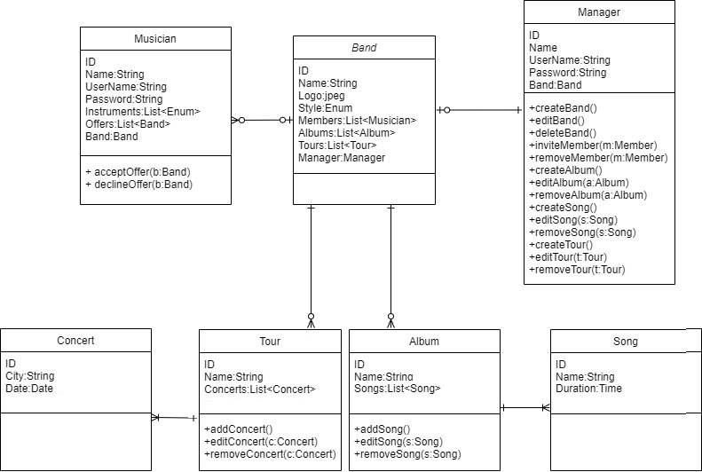

# PA165-music-band-manager
*The web application allows one music band to manage their activities.*

Managers can create a new band and start hiring team members from a catalogue. They can set for the band the musical style (e.g. rock, pop, etc…), a name, and a logo. Band managers can add new albums and songs to a band. Each Song has a name and a duration. Managers can also schedule tours for the bands, in terms of dates and cities visited.\
Team members can login to the system and see the offers made by the band managers. They can accept or reject to be part of a band. After they are part of a band, they can see all the activities that are planned and the profiles of the other band members.

# How to Run project

* You need two command line instances 
    * First for server (REST)
    * Second for client

* Server (first terminal):
    * from root of project: `mvn clean install`
    * go to server folder: `/rest`
    * run server: `mvn cargo:run`
    
 * Client (second terminal):
     * go to client folder: `/web-app`
     * install client: `npm install`
     * install angular-cli: `npm install -g @angular/cli`
     * run client: `ng serve`
     
 * After loading the web page and before login, you need to click on "create template data".

# Login Credentials 
* Admin accounts
    * Manager with an already created band without members. For testing of musician invitation.
        * Username: admin
        * Password: admin
    * Manager without band. For testing of band creation.
        * Username: admin2
        * Password: admin2
    * Manager with an already created band. The band includes members, albums, songs, tours and concerts.
        * Username: admin3
        * Password: admin3

* Regular accounts
    * Musician with no band. For testing of accepting and declining offers.
        * Username: user
        * Password: user
    
    * Musician with band. 
        * Username: freddie
        * Password: freddie
        
# README file with instructions about how to test the REST interface (e.g. CURL commands for the command line) you can find in folder /rest.

## Use Case Diagram

## Class diagram

